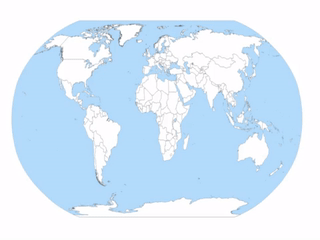

# What is this ?

When editing travel videos using [Shotcut](https://shotcut.org/), this tool allows to easily include a dynamic path like this:



# How to use it ?

- Go to this [link](https://mi-g.github.io/travelpath-webvfx)
- Follow the 3 steps:
  * pick a map image from your disk
  * define a path
  * copy the generated HTML code to the clipboard (click the code portion, CTRL+A to select everything, CTRL+C to copy)
- From Shotcut, create an *Overlay HTML* filter with *Webvfx* option checked
- Pick *New...* to create a new HTML file
- Paste the HTML code (CTRL+V)

# How does it work ?

The tool relies on the *Shotcut* ability to include HTML into a video being edited and to synchronize the frames using
*Webvfx*. For the travel path to work, you need to have the [Elusien `webvfx.js` file](http://www.elusien.co.uk/shotcut/) 
into the same directory as the generated HTML file.

# How to customize ?

You can load whatever map image you want, for instance [this public domain SVG world map](https://en.wikipedia.org/wiki/File:World_Map_Blank_-_with_blue_sea.svg).

Once the HTML file has been generated, you can easily edit a few parameters using a text editor:
- line color
- line width
- dash pattern

```javascript
	TravelPath({
		strokeStyle: "#ff0000", // path color
		lineWidth: 10,         // path line width in pixels
		lineDash: [1,15]       // dash pattern, set to null for no dashed line
	});
```

If you need deeper customization, you will have to edit the javascript code.

You can of course edit the travel path animation so that it appears as a thumbnail within the actual video. You
just need to know how to use [Shotcut](https://shotcut.org/tutorials/).

